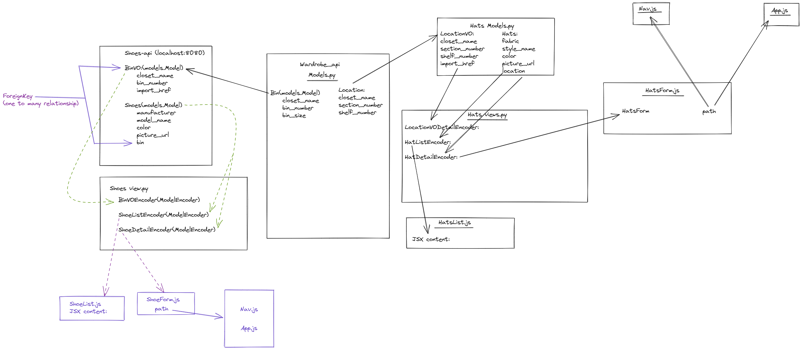

# Wardrobify

Team:

* Bobby - Hats
* Anthony - Shoes

## Design

## Shoes microservice

Experiments/Concerns:
    - In poller.py forgot to call get_bin function in poller function. This caused a lot of back and forth concerning a 400 error on insomnia.
        -
    - Unique key was cauing a problem with React fetching. The developer console was showing data, but React did not enjoy that I did not use a unqiue key specific to each object.

Differences in our form class:
ShoesForm.js > class ShoesForm constructor >in this.state i have bin: "" and bins: []
explanation: empty array for the drop down bar and the empty string to show that single piece of information.

Steps:
1. install Django app into shoes_project/settings.py. and place config into INSTALL_APP list.

2. Create model in shoes_rest/models.py: BinVO and Shoes

3. create view functions: api_list_shoes and api_show_shoe and encoders: BinVOEncoder, ShoeListEncoder, ShoeDetailEncoder for our models
    -api_list_shoes: GET, POST
    -api_show_hat: DELETE, GET

4. add new URLs in our apps urls.py

5. include the URLs from app into project directory URLs

6. Check insomnia to verify CRUD is working correctly for Bins
    - create:
    {
	"closet_name": "Closet 1",
	"bin_number": "1",
	"bin_size": "3"
}

    - see if Bins is showing a list
    - get details of one bin

7. Create ShoesList.js with a ShoeList Component (like AttendeeList or MainPage in past project)
    - create function with return for JSX for the list to be shown on front-end.
        - within the function create a deleteShoes varibale followed by functions that fetch for specific shoes id that will use a delete method on that data.
            - once complete we want to reload the front-end automatically to show that shoe has been deleted (useState, useEffect)
        - create table
            - map shoes to show data correctly with proper unique key.
8. Create ShoeForm.js with a ShoeForm component
    - JSX render contains a form to Create new shoes with the correct inputs and select in order for user to create new shoe entry on front end.
        - using contructor(props) we set this.sate to the right properties we want to be used and seen.
            - (manufacturer, model_name, pictured_url, color, bin, bins)
        - using handle methods for each property in state
        -   handleSubmit for submission
            - once submitted the form will clear for future use.
        - create componentDidmount function to mount data to the correct API

9. Add correct NavLink for navigation bar must import NavLink
    - Navlink: Shoes, New Shoes

10. Import ShoesList and ShoesForm into App.js
    - add correct Routes for the Nav in the return for function App(props)

11. create function get_bins for poller.py functionality to retrieve data for shoes_rest microservice

12. CRUD for Shoes microservice in Insomnnia for sanity check
    - create:
    {
	"manufacturer": "Nike",
	"model_name": "Dunk",
	"color": "Slam City",
	"pictured_url": "https://cdn.flightclub.com/750/TEMPLATE/080108/2.jpg",
	"bin": 1
}

13. Check localhost:3000 to see if Navigation bar is working and routes are correct

14. Git pull, Git add, git commit, git push. Back and forth with partner until our final pull and push to confirm all files are working correctly on main branch.

Anthony's explanations

Explain your models and integration with the wardrobe
microservice, here.

## Hats microservice
Bobby's explanations

Experiments/Concerns:

    -HatsForm.js, line 44: Added empty string for location variable(test)
    -explanation: Since we have an empty array, i made an empty string inside handleSubmit to catch each value inside the array(which would be created by user)

    -input tag: declaring value={this.state...}(test)
    -explanation: A value for the user input

    -In poller.py, we forgot to input get_locations function inside poll function which was causing 400 errors on insomnia

Step by Step:
1. We registered the hats app inside hats_project's settings.py, under INSTALLED_APPS.
2. We created models inside hats api models.py(LocationVO and Hats)

    - Referenced models.py and views.py from wardrope_api to get attributes -

3. We created view functions to show the list of our models.(LocationVODetailEncoder, HatListEncoder, HatDetailEncoder)
4.Created api_list_hats function to handle GET and POST methods
5. Created api_show_hat function to handle DELETE and GET methods for single objects
6. Created URL paths inside urls.py for functions in views.py
7. Created URL paths inside project's urls.py for the paths inside app's urls.py
8. Checked insomnia to verify that paths/urls are working properly with GET/DELETE/POST methods
9. Created HatsList.js to display list of hats page.
    -First started by creating HatsList function, then creating JSX format for contents that i want on the webpage
    -Created a deleteHat variable to handle delete requests on webpage
    -Added a useState method to make list of hats update list(on webpage, without having to hard refresh)
10. Created a HatsForm.js to display form to create hats
    -Added content to JSX in div tags with a form tag to handle submits and also display content for each section within the form
    - Added constructor(props) to declare the variables i want to use inside the form
    - Added handle methods for each content section inside form(fabric, style_name, color, picture_url, and locations)
    - Added handleSubmit function so once the form has been successfully submitted, the form will automatically reset the form and will display an empty form, ready to be filled out and submitted again
    - Created specific handle methods for every attribute in constructor
    - Created componentDidMount function with an await fetch method setState locations, data.locations
11. Added li tags for navlinks with paths to hats list and hats form pages(had to import NavLink)
12. Imported HatsList and HatsForm inside app.js
13. Added routes to HatsList and HatsForm under Routes tag(inside JSX content)
14. Checked insomnia to make sure every method was working as intended
15. Checked localhost:3000 to make sure every link was working and is doing what its supposed to
16. Git added, committed and pushed then waited for partner to do the same, then did a final pull and push to confirm both of us had working projects

Explain your models and integration with the wardrobe
microservice, here.
